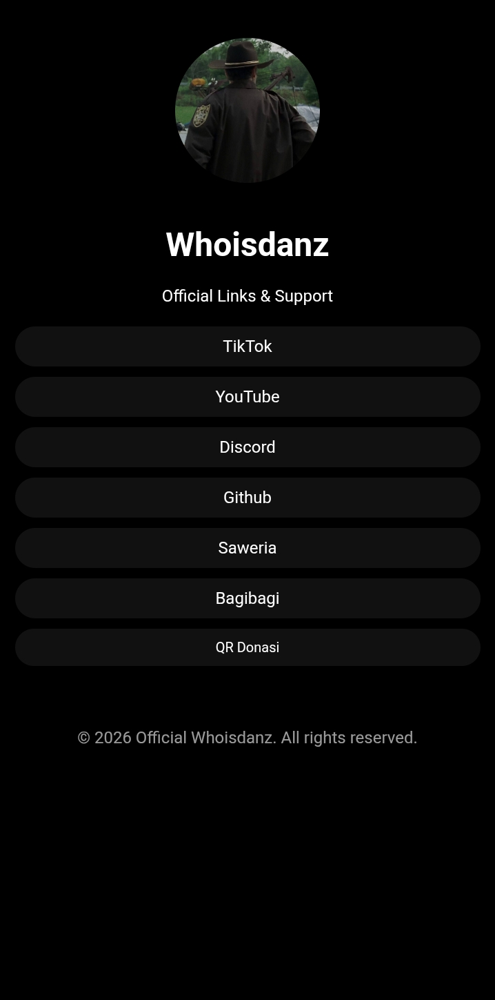

# Whoisdanz Official Links & Support Page

Halaman sederhana "link-in-bio" resmi untuk Whoisdanz (@whoisdanz12) – tempat mengumpulkan semua link sosial media, donasi, dan konten utama dalam satu tampilan clean & dark theme.

## Fitur Utama
- Loading screen animasi premium (ring mutar + progress bar halus)
- Profile picture circular + nama & deskripsi
- Daftar link sosial media & donasi (TikTok, YouTube, Discord, GitHub, Saweria, Bagibagi)
- Modal QR Donasi dengan tombol download gambar QR
- Background music otomatis (satu lagu loop) setelah loading selesai
  - Mulai muted jika browser blokir autoplay → unmute setelah user klik pertama kali
- Desain responsive (mobile-first), dark mode full black
- Footer dengan copyright dinamis

## Demo / Live Preview
🔗 https://whoisdanz-link.vercel.app/

## Teknologi yang Digunakan
- HTML5
- CSS3 (Flexbox, Animasi keyframes, Gradient, Responsive)
- Vanilla JavaScript (tanpa framework)
- Audio HTML5 untuk background music

## Struktur Folder
├── index.html          # Halaman utama
├── style.css           # Semua styling
├── script.js           # Logika QR modal & background music
├── profile.png         # Foto profil (circular)
├── qr.png              # Gambar QR donasi
└── soundtrack.mp3      # File musik background (loop)

## Cara Deploy Sendiri
1. Clone atau download repository ini
2. Ganti file:
   - `profile.png` → foto profil kamu
   - `qr.png` → gambar QR donasi
   - `soundtrack.mp3` → file musik yang kamu inginkan (MP3)
3. Upload ke hosting gratis:
   - **GitHub Pages** → buat repo baru, push file, aktifkan Pages di Settings → Pages
   - **Vercel** / **Netlify** → drag & drop folder atau connect GitHub repo
4. Akses link yang diberikan hosting → selesai!

## Customisasi
- Ganti warna → edit `#000`, `#111`, `#222` di `style.css`
- Tambah link baru → tambah `<a>` di `.links` div
- Ganti musik → ganti nama file di `script.js` (variabel `soundtrackFile`)
- Nonaktifkan musik → hapus tag `<audio>` dan kode di `script.js`

## Lisensi
MIT License – bebas dipakai, dimodifikasi, dan didistribusikan.

## Kontak / Support
- TikTok: [@whoisdanz12](https://www.tiktok.com/@whoisdanz12)
- YouTube: [@whoisdanz12](https://www.youtube.com/@whoisdanz12)
- Discord: [Join Server](https://discord.gg/hnZhbbq4)
- Donasi: Saweria / Bagibagi / Scan QR

Terima kasih sudah mampir! 🔥  
© 2026 Whoisdanz – All rights reserved.
